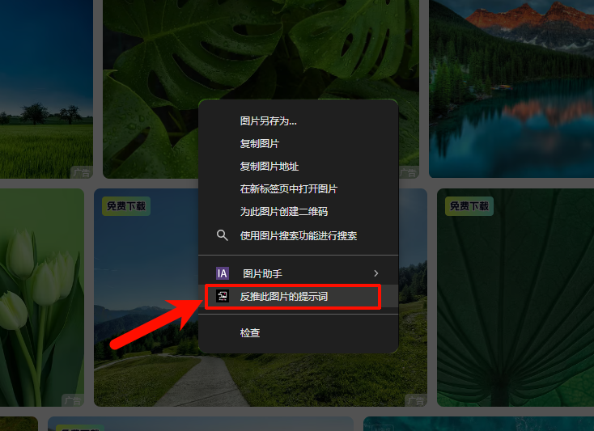
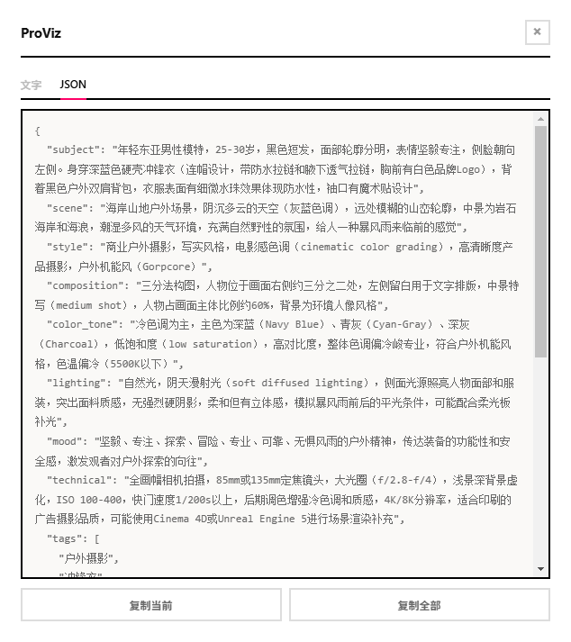
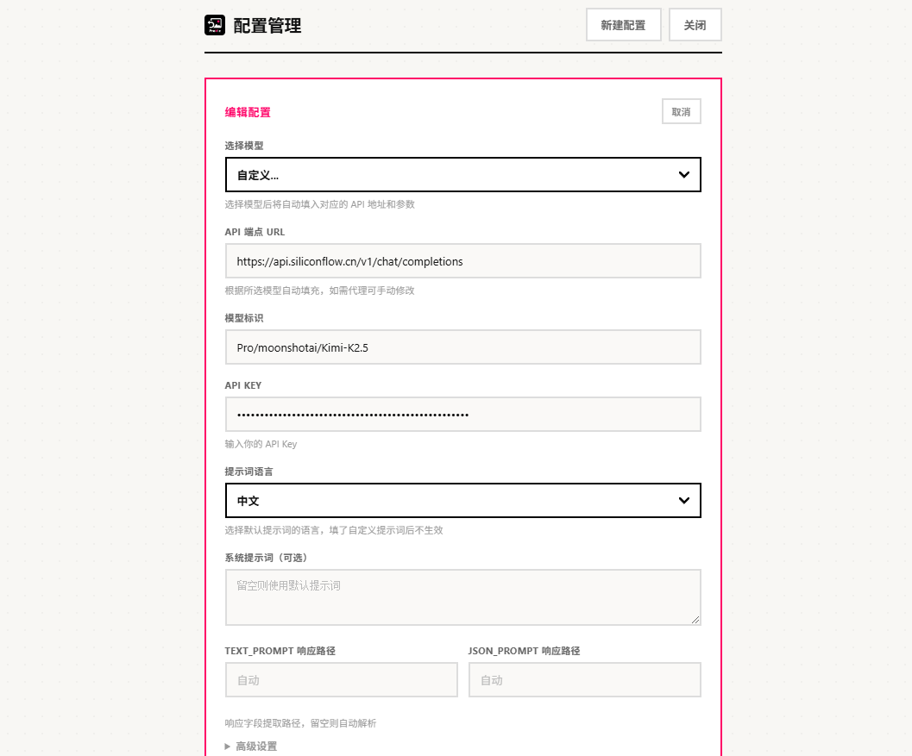

# ProViz

一款 Chrome 扩展，通过 AI 视觉模型反推图片的提示词（Prompt），支持多模型、多 API 配置管理。

## 开发初衷

玩 AI 绘画的朋友经常会遇到这种情况：看到一张很喜欢的图，想知道它用的是什么提示词（Prompt）生成的。虽然可以靠肉眼分析构图、风格、光线，但总是不够精确。市面上也有一些反推工具，但要么需要付费，要么绑定特定模型，用起来束手束脚。

ProViz 就是为了解决这个问题而生的 —— 免费、开源、自由选择模型，把控制权完全交给你。

## 关于作者

- GitHub：[@milusvip](https://github.com/milusvip)
- 邮箱：svip1060@qq.com
- QQ：10601213

## 功能

- **右键反推**：在任意图片上右键 →「反推此图片的提示词」→ 确认后自动分析
- **语言选择**：反推前可选中文/英文输出
- **多 API 配置**：同时管理多组 API Key，随时切换
- **结果展示**：文字 + JSON 双视图，支持复制
- **历史记录**：自动保存分析结果

## 支持的模型

| 供应商 | 模型 |
|--------|------|
| Anthropic | Claude Sonnet 4, Opus 4, 3.5 Sonnet, 3.5 Haiku, 3 Opus, 3 Haiku |
| OpenAI | GPT-4o, GPT-4o Mini, GPT-4.1, GPT-4.1 Mini, GPT-4.1 Nano |
| Google | Gemini 2.5 Pro, Gemini 2.0 Flash |
| 其他 | Qwen VL Max, Step-2, DeepSeek VL2，以及任意兼容 OpenAI 格式的 API |

## 安装

1. 下载或克隆本仓库
2. 打开 Chrome → `chrome://extensions`
3. 开启「开发者模式」
4. 点击「加载已解压的扩展程序」→ 选择项目目录

## 使用

1. 点击扩展图标 →「前往设置」→ 选择模型并填入 API Key → 保存
2. 在任意网页右键图片 →「反推此图片的提示词」
3. 选择语言（中文/English）→ 点击「开始反推」
4. 等待分析完成，查看结果

## 从旧版迁移

如果你之前使用的是单配置版本，插件会自动迁移旧配置到新版的多配置格式。

## 许可证

MIT
